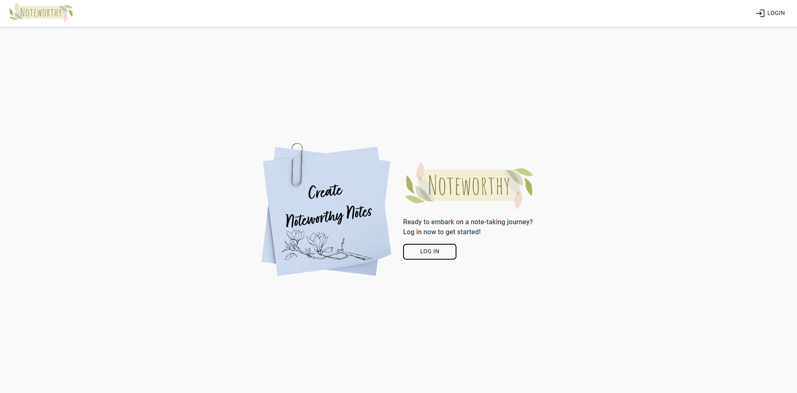

# Noteworthy: A Notetaking-app created with React

Ready to embark on a note-taking journey? Create `noteworthy notes` with `Noteworthy`. Note is shared among all the users. However, only the note's creator can edit and delete it.
I recreated this app in `React` by using the same backend as in `Vue` version. Visit the (React) web app using this link: [Noteworthy: A Notetaking-app](https://react-notetaking-app-reau.vercel.app/)
> *How to log in? Simple! Use the account and password provided below* ;)

### Tools used

> Frontend

- `React` used as a Frontend Framework
- `TypeScript`
- `Material UI (MUI5)` used as CSS framework
- `CSS`
- `React router` used for routing
- `Redux Toolkit` used for managing global states
- `Axios` used instead of fetch in this (React) version
- `Material Icons` used for icons in this version instead of font-awesome

> Backend

- `Node.js`
- `Express.js`
- `MongoDB (cloud)`

> Testing: it will be also added later

- `Cypress` for end to end testing

### Responsive Design

- The website is made responsive.
 > Here, you can see examples for `small` and `large` screens
 >
 >  
 
  

### Functionalities added

- Backend added and routes were tested using `postman`
- Requires a login to access
- It allows for more than one user. Each user have a username and an individual password
- 404 page redirects user to home page
- The app allows the user to create and read notes
- Created notes are saved and retrieved on next visit
- It shows which user created a note. Note can be opened in a modal when clicked on (note) card content
- It allows only note's creator to edit and delete it
- A note's creator is also allowed to make their note private which means other users can't see it
- Home page shows notes by all users and My notes pages shows notes created by the authenticated user
- It's accessible from a public url. Backend is deployed using [Render](https://render.com/) and Frontend is deployed using [Vercel](https://vercel.com/)

### Functionalities to be added

- Test using Cypress

#### Log in via these Accounts

You can log in using 3 different accounts to test the project:
| Username | Password |
|-----------------|-----------------|
| `Hermione` | `Hermione1` |
| `Ron` | `Ron1` |
| `Harry` | `Harry1` |

### Opening/ Running the file locally

#### Backend

> `cd backend`

> `npm install`

> `npm run dev` or `npm run start`

#### Frontend

> `cd frontend`

> `npm install`

> `npm run dev`

### Links used

- [Adobe express](https://new.express.adobe.com/) used for creating logo
- [css-box-shadow-examples](https://getcssscan.com/css-box-shadow-examples) used for Box-shadow
- [Microsoft copilot](https://copilot.microsoft.com/) used to generate animated drawings as well as using AI while coding
- [animista](https://animista.net/), CSS animations library, used for animations

### Final Notes
> There are some notes already created in Hermione's and Ron's account but I have intentionally left Harry's account empty to show the difference. 
> Even though the final design is my own, I took a lot of inspiration from [Google keep](https://keep.google.com/), [Dribbble](https://dribbble.com/) and [Facebook Posts](https://www.facebook.com/).
